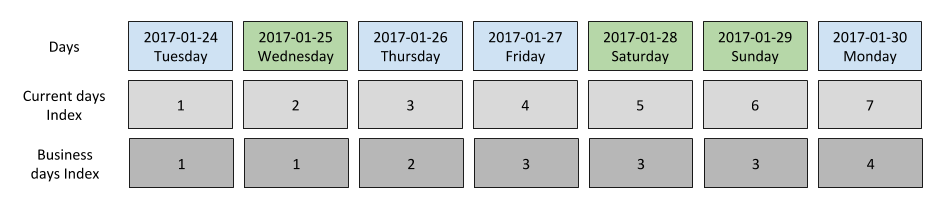

```{r setup, include=FALSE}
knitr::opts_chunk$set(echo = TRUE)
```

## How bizdays counts business days

To compute the number of business days between two dates effectively and with a good performance, `bizdays` creates two indexes where business days contribute with one unit and nonworking dates contribute with zero units.
These two indexes, called forward and backward, are contructed by labeling the business days and extending those labels to nonworking days.
Let's consider a sequence with all dates of a range.
If the business days are filtered into a new sequence, each business day has an identification number which is its position in that sequence.
Taking these identification numbers to the original sequence of dates, the nonworking dates don't have such a number, so they use the identification number of its business day neighbor.
To fulfil the nonworking days in the forward index the nonworking days the number of its left neighbor is used, and the backward index uses the right neighbor's number.
Doing this way, every business day has the same identification number in both indexes.

The figure below shows a representation of these indexes



The blue boxes are working days and the green ones nonworking days.
As we can see, from Tuesday to Monday we have 7 days (one week), starting at 1 and ending up at 7 in the current days index (which is represented by the `actual` calendar).
In the business days indexes the counting starts at 1 and ends up at 4 and 4 is the total number of business days shown.
The differences appear in the business days indexes, where the nonworking days share the index with its business days neighbors, as explained.

To compute the number of business days between two dates bizdays subtracts the index values associated with the given dates in each index and take its minimum.
This is done to avoid having incorrect business days calculations in situations where the arguments `from` and `to` are given nonworking days.

Let's create a calendar with these dates to illustrate.

```{r message=FALSE, warning=FALSE}
library(bizdays)

create.calendar(name = "example1", weekdays = c("saturday", "sunday"), start.date = "2017-01-24", end.date = "2017-01-30", holidays = "2017-01-25")
calendars() # to list all calendars
```

Calling the `bizdays` function to compute the business days from 2017-01-24 to 2017-01-26 results in:

```{r}
bizdays("2017-01-24", "2017-01-26", "example1")
```

one business day which is the difference of index values, but the interval (2017-01-24, 2017-01-26) has two business days.
Another example, starting and ending up at the holiday, we get

```{r}
bizdays("2017-01-24", "2017-01-25", "example1")
bizdays("2017-01-25", "2017-01-26", "example1")
```


```{r}
bizdays("2017-01-25", "2017-01-28", "example1")
```

```{r}
offset("2017-01-25", 1, "example1")
```


This result happens because of the two indexes, if we consider only one index these function calls would return different results.

`bizdays` doesn't return the number of business days in a interval, it returns the jumps between business days into the interval.
This is the way days are counted in the financial insdustry to compound interest rates, for example.
`bizdays` calculations are straighforward when the arguments `from` and `to` are business days, and if any of these arguments are passed nonworking days the result might be unexpected.
To work around this situation we have the arguments `adjust_from` and `adjust_to` on `create.calendar`.
These have been created, to execute a date adjustment of the arguments `from` and `to` according to users needs.
These arguments can be set with one of these three functions:

- `adjust_none`: the default value, does not execute date adjustment
- `adjust_previous`: move the date for the previous business day if it is nonworking day
- `adjust_next`: move the date for the next business day if it is nonworking day

So the user can have more control on the resutls.